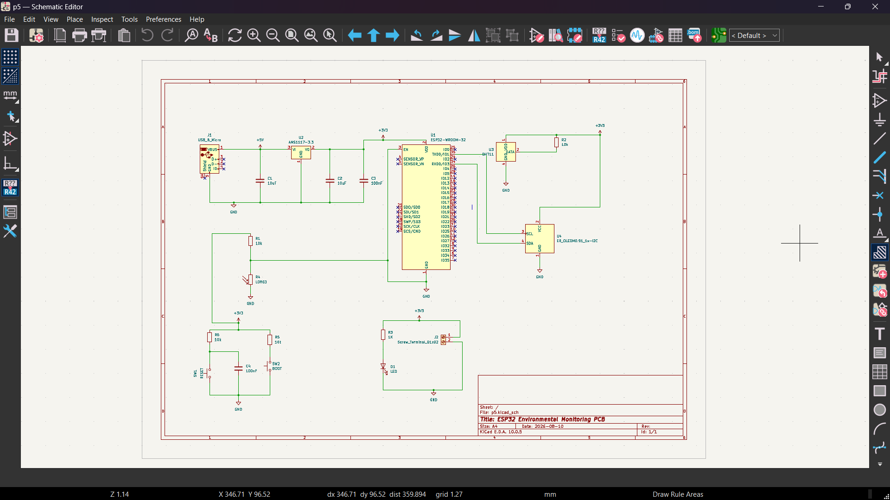
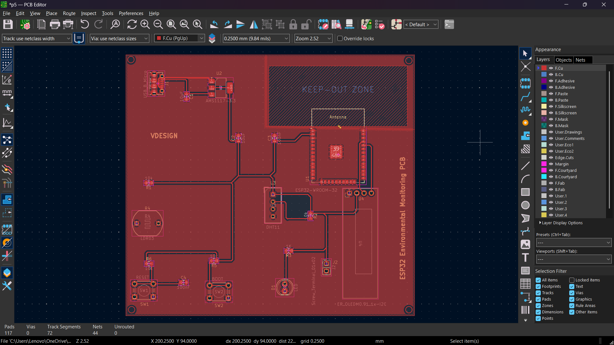
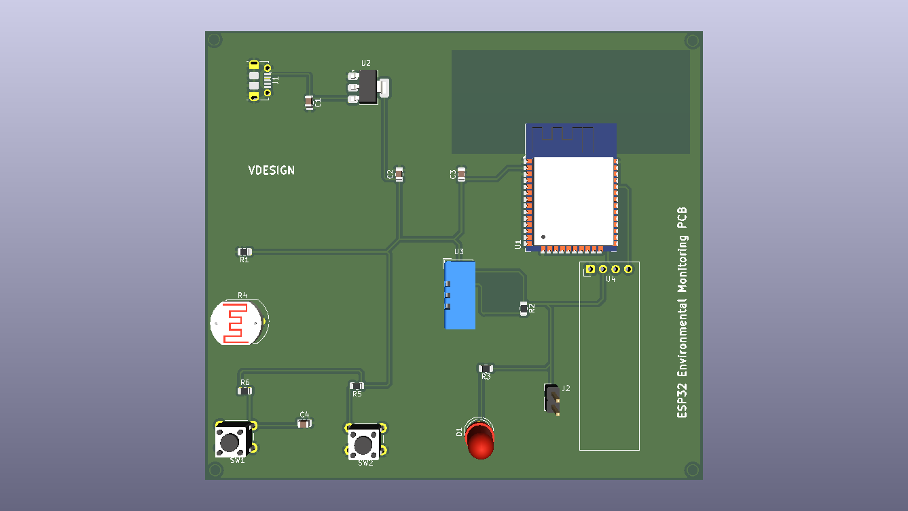
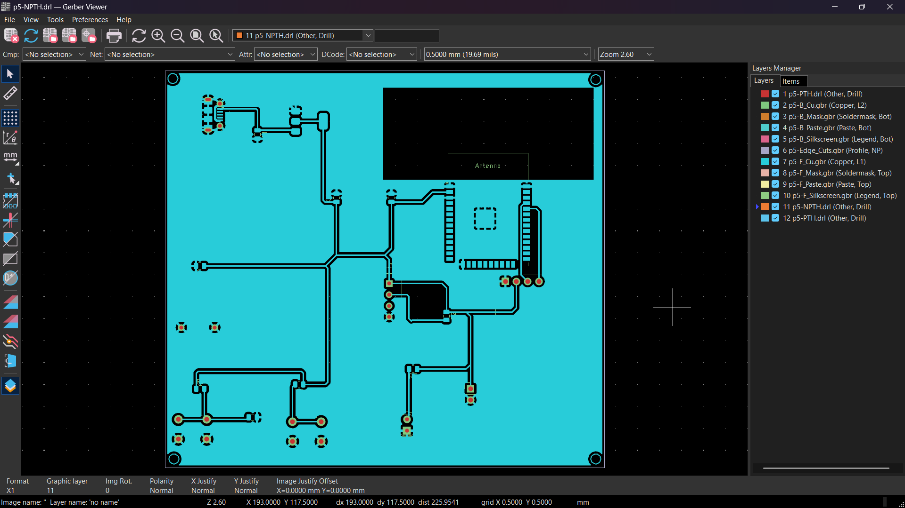

# ESP32 Environmental Monitoring PCB

A custom 2-layer PCB designed in KiCad for an ESP32-based environmental monitoring system.

## Features

- ESP32-WROOM-32
- DHT11 temperature and humidity sensor
- OLED I2C display
- LDR light sensor
- 5V USB power input
- AMS1117-3.3V regulation
- Reset and Boot buttons
- Power LED
- 4 × M3 mounting holes
- GND copper zone
- Custom PCB routing
- DRC verified
- Manufacturing-ready Gerber and drill files

## Hardware

| Component | Function |
|---|---|
| ESP32-WROOM-32 | Main Controller |
| DHT11 | Temperature & Humidity |
| LDR | Light Detection |
| OLED | I2C Display |
| AMS1117-3.3 | 5V to 3.3V Regulation |
| USB | Power Input |

## ESP32 Connections

| ESP32 Pin | Function |
|---|---|
| GPIO4 | DHT11 Data |
| GPIO21 | OLED SDA |
| GPIO22 | OLED SCL |
| GPIO34 | LDR ADC |
| GPIO0 | Boot |
| EN | Reset |

## Design Tools

- KiCad
- Schematic Editor
- PCB Editor
- 3D Viewer
- Gerber Viewer

## PCB Design

The PCB was designed as a 2-layer board with a dedicated GND copper zone, custom routing, antenna keep-out area and four M3 mounting holes.

## Manufacturing

Gerber and PTH/NPTH drill files are included for PCB manufacturing.

## Project Images

### Schematic

### PCB Routing

### 3D PCB

### Gerber View

## Author

**Vishal Bodkhe**

Electronics & Computer Engineering
